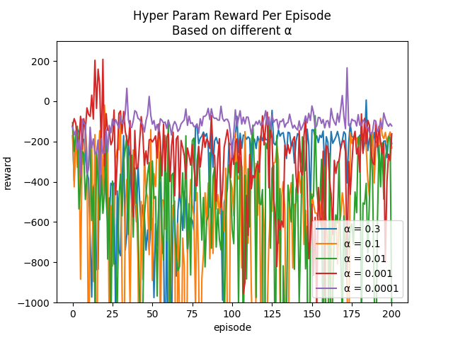
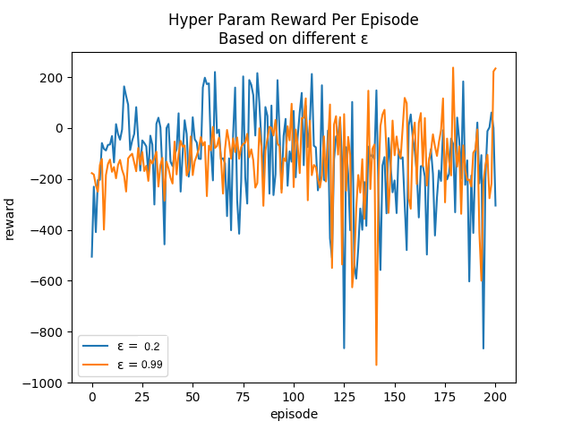
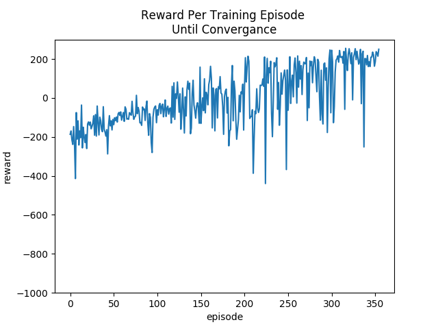

# Lunar Lander
Open AI Gym Lunar Lander simulation and hyper param tuning.  Using Q-learning
with neural networks to navigate continuous state spaces.

## Usage
To utilize this project be sure to use Python 3 and install the necessary
modules using the following from the project root:
```
pip install --trusted-host pypi.python.org -r requirements.txt
```

Once installed the project can be executed in 2 parts, hyper param testing and
simulation to gather data for overall agent analysis.  The following will execute
the hyper params simulation.  The file can be modified to test out various
alpha, epsilon, and any other hyper params desired, along with plotting results

```
python src/params.py
```

Once hyper parameters are found, the simulation can be re-run using the following.
This allows the user to focus on the ability and efficiency of the agent in the
state space.  Various simulation params can be adjusted such as reward average,
value of average reward convergence, etc.

```
python src/simulation.py
```

## Results
Open AI has created the Gym to provide users with various domains and state spaces
to test out various reinforcement learning approaches.  This example focuses on
illustrating the Q-learning model in a continuous state space, i.e. a state space
with infinite measurements.  A traditional approach of exploring all potential
states and their various actions is not feasible.

### Hyper Parameters
Hyper parameter tuning is important as it allows an agent to use the optimal
parameters for given domain while trying to prevent overfitting.

#### Learning Rate
Alpha, [or the learning rate](https://en.wikipedia.org/wiki/Learning_rate), that
the agent uses was the first focus for this simulation.  A learning rate too great
meant that agent would skip past an optimal solution, too small and information
will be too slow or never occur for convergence.

The following were the results of the alpha param testing:



#### Exploration
Epsilon, [or the rate of exploration](https://en.wikipedia.org/wiki/Multi-armed_bandit),
that the agent will utilize to determine how much new information is sought with
each episode.  Various strategies mentioned in the article above were considered
however unnecessary as convergence was still obtainable with a simple approach.

The following were the results of the epsilon param testing:



### Simulation
With the hyper parameters selected, the agent's ability can now be observed. If
viewing the lander's realtime actions is desired rendering can be enabled.  The
ability of the agent will be tested by its consistency of achieving a certain
reward over a desired number of trials.  Since the state space is infinite, the
agent needed a way to utilize the input information and choose correct actions.
The solution, utilizing a double layer neural network to ingest the inputs and
narrow the values to finite number of outputs which the Q-learning can more
capably act upon.

The following were the results of testing the agent's ability to converge:


